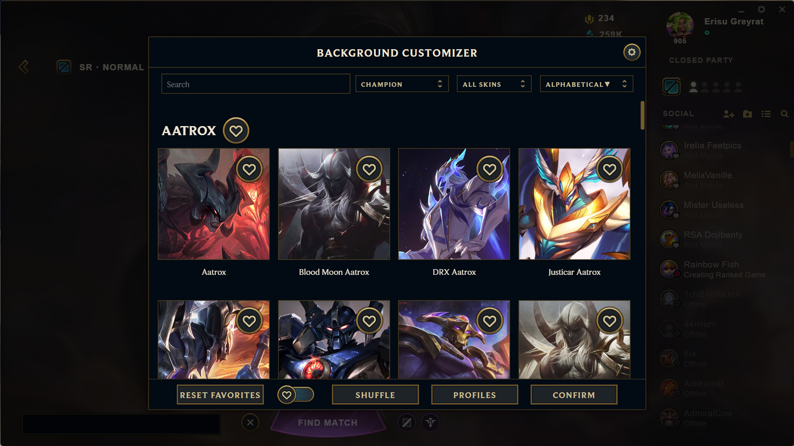
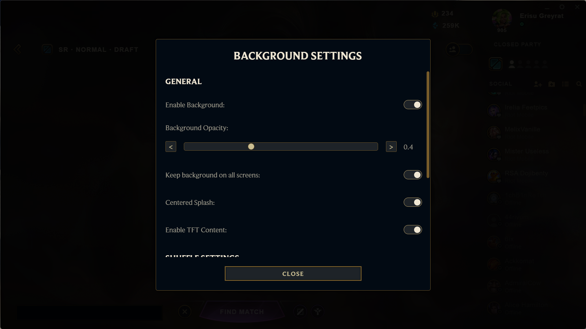
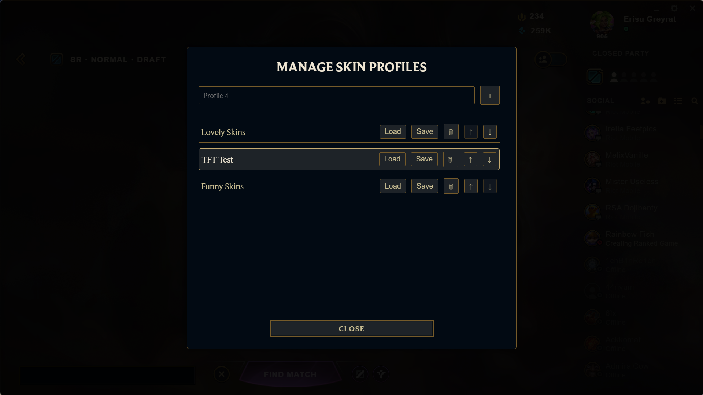
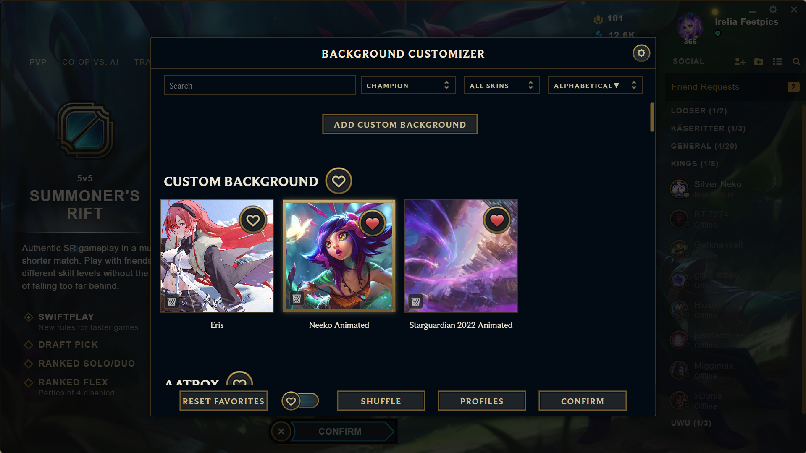
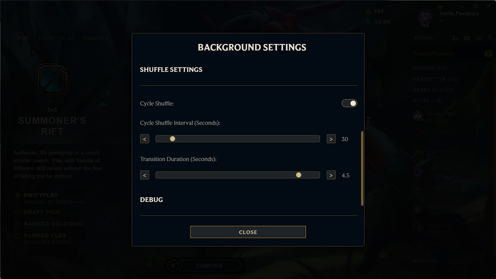
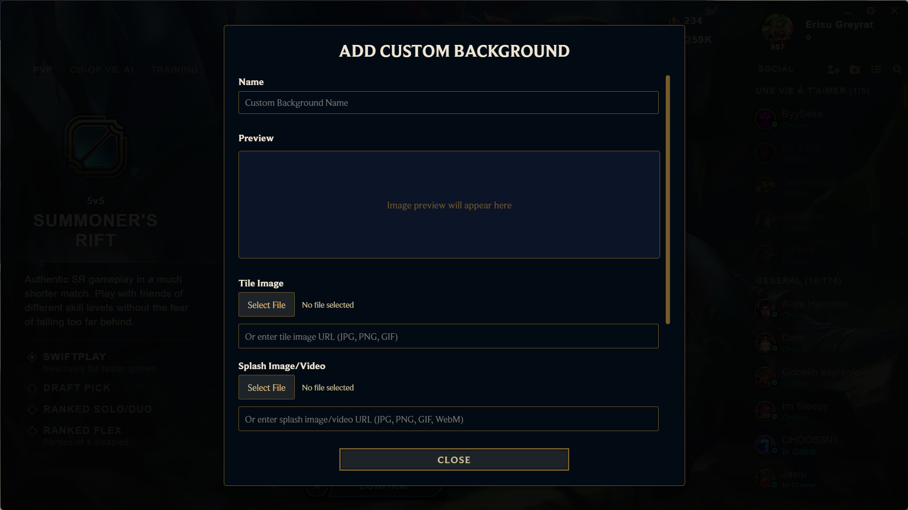

# Background Customizer

A Pengu Loader plugin to customize the League of Legends client with dynamic backgrounds. Built by [Erisu](https://github.com/ErisuGreyrat). Best used with my [Acrylic League Theme](https://github.com/ErisuGreyrat/acrylic-league-theme).

## Screenshots

| Main UI | Settings | Profiles |
|--------|----------|----------|
| [](Preview/Main.png) | [](Preview/Settings.png) | [](Preview/Profiles.png) |

| Main UI (Alternate) | Shuffle Settings | Custom Backgrounds |
|---------------------|------------------|---------------------|
| [](Preview/Main2.png) | [](Preview/ShuffleSettings.png) | [](Preview/CustomBackground.png) |

## Features

- Set backgrounds from champion skins, universes, skinlines, TFT companions, or custom-uploaded images/videos.
- Save favorite skins and create profiles for quick background switching.
- Randomize backgrounds or enable automatic shuffle cycling (10–300s intervals).
- Search and filter backgrounds by champion, universe, skinline, or name.
- Adjust opacity (0.1–1.0), transition duration (0–5s), and toggle centered splash or TFT content.
- Add custom backgrounds with support for JPG, PNG, GIF, and WebM formats (up to 10MB for images, 20MB for videos).
- Clean, League-inspired UI optimized for the Acrylic League Theme.

## Installation

1. Install [Pengu Loader](https://github.com/PenguLoader/PenguLoader).
2. Clone or download this repository:
   ```bash
   git clone https://github.com/ErisuGreyrat/pengu-background-customizer.git
   ```
   Place Background-Customizer.js in your Pengu Loader plugins folder (e.g., `C:\Users\YourName\AppData\Local\Pengu Loader\plugins\`).
3. Optionally, install the [Acrylic League Theme](https://github.com/ErisuGreyrat/acrylic-league-theme):
   ```bash
   git clone https://github.com/ErisuGreyrat/acrylic-league-theme.git
   ```
4. Launch League of Legends via Pengu Loader. Click the “BGC” button in the lobby to open the customizer.

## Usage

- **Open**: In the lobby, hover left to reveal the “BGC” button and click to open the customizer.
- **Choose Background**: Search or filter skins by champion, universe, skinline, or favorites, then select a skin and click “Confirm”.
- **Add Custom Background**: In the “Custom Background” section, click “ADD CUSTOM BACKGROUND” to upload a JPG, PNG, GIF (≤10MB), or WebM video (≤20MB).
- **Settings**: Click the cog icon to adjust opacity (0.1–1.0), transition duration (0–5s), centered splash, TFT content, or enable auto-cycling (10–300s intervals).
- **Profiles**: Click “PROFILES” to save, load, or manage skin sets.
- **Shuffle**: Click “Shuffle” for a random background or enable auto-cycling in settings for periodic shuffling.

## Compatibility

- **Pengu Loader**: Latest version.
- **League Client**: Tested on live client (May 2025).
- **Acrylic League Theme**: Recommended for enhanced visuals.
- **Data Source**: [Community Dragon](https://www.communitydragon.org/).

## Troubleshooting

- **No “BGC” button?** Ensure the plugin is in the correct folder and League is launched via Pengu Loader.
- **Backgrounds not loading?** Check your internet connection and toggle “Enable Background” in settings.
- **UI issues?** Use the Acrylic League Theme for better styling.
- **Need help?** Open an [issue](https://github.com/ErisuGreyrat/pengu-background-customizer/issues).

## Contributing

Fork the repo, create a branch, make changes, and submit a Pull Request.

## Credits

- **Developer**: [ErisuGreyrat](https://github.com/ErisuGreyrat)
- **Assets**: [Community Dragon](https://www.communitydragon.org/)

## License

MIT License. See [LICENSE](LICENSE).